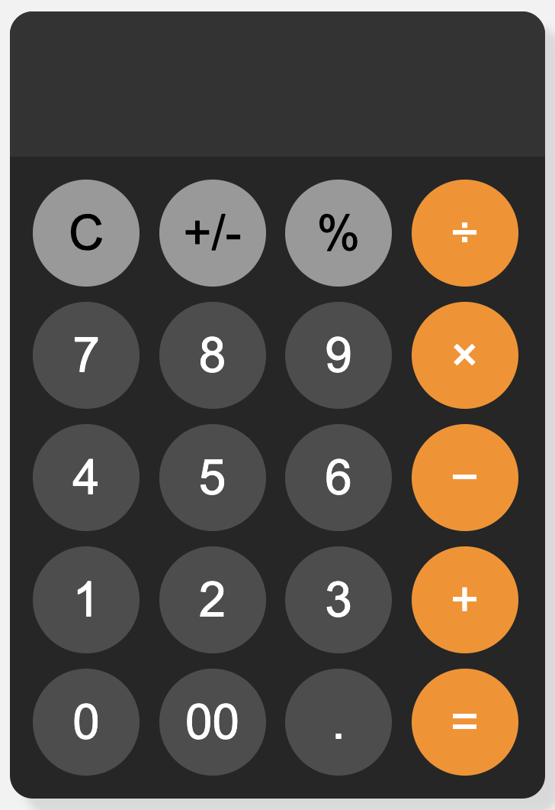

<h1 align="center">Calculator Project</h1>

  

This project is a simple web-based calculator implemented using HTML, CSS, and JavaScript. It provides basic arithmetic operations and includes responsive design for various screen sizes.

#### Project Structure

- **index.html**: Contains the structure of the calculator interface using HTML5.
- **styles.css**: Defines the visual layout and styling of the calculator using CSS.
- **scripts.js**: Implements the calculator logic using JavaScript.

#### Features

- **Responsive Design**: The calculator interface adjusts its layout and button sizes based on the screen width using media queries in CSS.
- **Basic Operations**: Supports addition, subtraction, multiplication, and division operations.

- **Error Handling**: Displays an error message ("\*Invalid") and clears the display after a failed calculation attempt (e.g., division by zero).

#### Interface Elements

- **Display**: Located at the top of the calculator, shows the input and result of calculations.
- **Buttons**: Grid of buttons arranged in a 4x5 grid:
  - Numeric buttons (0-9, including double-zero)
  - Operator buttons (+, -, \*, /)
  - Special buttons for percentage (%) and sign change (+/-)
  - Clear button (C) to reset the display

#### Styling

- **Colors**: Dark theme with varying shades of grey and blue-green for buttons, ensuring visibility and aesthetic appeal.
- **Button Interaction**: Buttons change color on hover and click for user feedback.

#### Usage

1. **Input**: Click numeric and operator buttons to input numbers and operations into the display.
2. **Calculation**: Click the '=' button to evaluate the expression displayed.
3. **Clear**: Use the 'C' button to clear the display.

#### Installation and Deployment

To run this project locally:

1. Clone the repository or download the files (`index.html`, `styles.css`, `scripts.js`).
2. Open `index.html` in a web browser that supports JavaScript.
